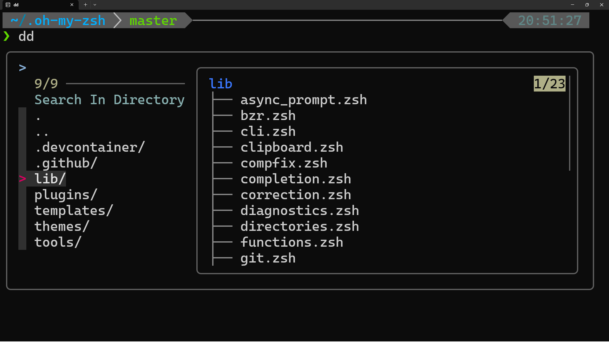
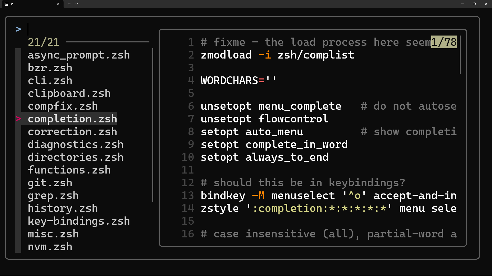

# Zsh 생산성 설정 (my-utils-zsh-settings)

`fzf`(Fuzzy Finder)를 기반으로, `fd`(파일 찾기), `rg`(내용 검색), `bat`/`lsd`(미리보기) 등 모던 CLI 도구들을 연동하여 WSL(Ubuntu) 셸의 생산성을 극대화하는 개인 설정 모음입니다.

---

## 🌟 주요 기능 (Showcase)

이 설정의 핵심은 셸의 가장 빈번한 작업인 '파일 열기', '내용 검색', '디렉터리 이동'을 강력한 `fzf` 인터페이스로 대체하는 "FZF 3대장" 함수입니다.

1.  **`dd` - Fuzzy Directory Navigator (디렉터리 이동)**
    * `fzf` 인터페이스를 열어 현재 디렉터리의 하위 폴더 목록을 보여줍니다.
    * `lsd`가 설치된 경우, 오른쪽 미리보기 창에 선택한 폴더의 하위 구조가 **트리(tree)** 형태로 표시됩니다.
    * **(핵심)** `..` (상위 폴더)를 선택해 위로 올라가거나, 하위 폴더로 들어가는 등, `cd`를 여러 번 입력할 필요 없이 **fzf 창 안에서만 연속적인 탐색이 가능합니다.**

2.  **`v` - Fuzzy Vim Opener (파일 열기)**
    * `fzf` 인터페이스를 열어 현재 디렉터리의 **파일** 목록을 보여줍니다.
    * 키보드 화살표로 파일을 선택하면, 오른쪽 미리보기 창에 `bat`이 **실시간으로 해당 파일의 코드 내용**을 구문 강조하여 보여줍니다.
    * `Enter` 키로 파일을 `vim`에서 바로 엽니다.

3.  **`f` - Fuzzy Content Search (내용 검색)**
    * `f [검색어]` (예: `f setopt`)를 입력하면, `ripgrep(rg)`이 **현재 폴더 및 모든 하위 폴더**를 재귀적으로 탐색하여 "setopt"라는 텍스트를 포함한 **파일 목록**을 보여줍니다.
    * `fzf` 미리보기 창에는 `bat`과 `rg`를 조합하여, **검색된 키워드("setopt")가 하이라이트된** 실제 파일 내용을 보여줍니다.

| `dd` (디렉터리 이동) | `v` (파일 열기) | `f` (내용 검색) |
| :---: | :---: | :---: |
|  |  |  |

---

## 🛠️ 설치 및 적용 방법 (Setup Guide for Visitors)

이 설정은 `oh-my-zsh` 환경을 기반으로 하며, 여러 핵심 CLI 도구에 의존성을 가집니다.

### 1단계: Zsh 및 Oh My Zsh 설치

가장 먼저 Zsh와 `oh-my-zsh` 프레임워크가 설치되어 있어야 합니다.

```bash
# Zsh 설치 (Ubuntu/Debian)
sudo apt install zsh
# Oh My Zsh 설치 (설치 스크립트 실행)
sh -c "$(curl -fsSL [https://raw.github.com/ohmyzsh/ohmyzsh/master/tools/install.sh](https://raw.github.com/ohmyzsh/ohmyzsh/master/tools/install.sh))"
```

### 2단계: (선택) Powerlevel10k 테마 설치

이 저장소의 `p10k` 관련 설정은 [Powerlevel10k 테마](https://github.com/romkatv/powerlevel10k#oh-my-zsh) 설치를 권장합니다. (필수는 아님)

### 3단계: 필수 의존성 도구 설치 (핵심)

"FZF 3대장" 함수를 사용하기 위해 아래 도구들을 설치해야 합니다.

```bash
# 1. fzf (Fuzzy Finder)
sudo apt install fzf

# 2. ripgrep (rg) (내용 검색)
sudo apt install ripgrep

# 3. fd (fdfind) (파일/디렉터리 찾기)
sudo apt install fd-find

# 4. bat (batcat) (미리보기)
sudo apt install bat

# 5. lsd (미리보기) (Rust/Cargo 필요)
# (Rust 설치 후) cargo install lsd
```

### 4단계: 이 설정 적용하기

이 레포지토리의 커스텀 설정을 님의 Zsh 환경에 적용합니다.

1.  이 레포지토리를 원하는 위치에 `clone` 합니다.
    ```bash
    git clone [https://github.com/](https://github.com/)[Your_ID]/my-utils-zsh-settings.git ~/my-zsh-settings
    ```
2.  VS Code나 Vim으로 님의 `~/.zshrc` 파일을 엽니다.
3.  `~/.zshrc` 파일의 **맨 아래**에 (Oh My Zsh 설정 이후) 다음 한 줄을 추가합니다.
    ```zsh
    # Load my custom settings
    source ~/my-zsh-settings/my_custom_settings.zsh
    ```
4.  터미널을 다시 시작하면(`exec zsh`) `v`, `f`, `dd` 등의 모든 커스텀 함수와 별칭이 적용됩니다.

---

## ⚡️ `my_custom_settings.zsh`의 주요 별칭 (Aliases)

* **`b`**: `batcat` (bat)
* **`c`**: `clear`
* **`p`**: `python3`
* **`fd`**: `fdfind`
* **`e`**: `explorer.exe .` (WSL에서 현재 폴더를 Windows 탐색기로 열기)
* **`d`**: `dirs -v`
* **`s`**: `pushd 1>/dev/null`


